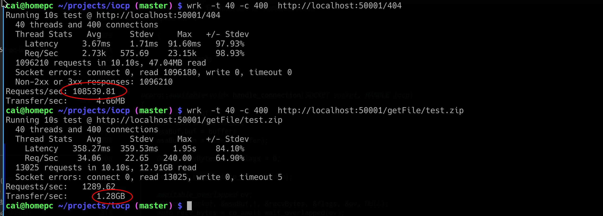

# iocp4linux

## 序

iocp4linux 如名字所言，它在 Linux 上实现IO完成端口。它的目的和 WEPOLL 正好相反。

iocp4linux as name suggest, provide windows equivalent IOCP API for linux. This is the reverse
of what wepoll does.

## Usage

将 iocp.cpp 和 iocp.h 俩文件带入你的项目即可。

just add iocp.cpp and iocp.h to your project and compile with the rest codes.

## Compatibale

已经实现的接口有

| IOCP 接口    | 状态 |
| -------- | ------- |
| CreateIoCompletionPort | ✅    |
| GetQueuedCompletionStatus  | ✅ |
| PostQueuedCompletionStatus   |  ✅  |
| WSASend    |  ✅  |
| WSARecv    |  ✅  |
| WSASendTo    |  ✅  |
| WSARecvFrom    |  ✅  |
| AcceptEx   |  ✅  |
| WSAConnectEx |✅ |
| DisconnectEx |✅ |
| CreateFileA |✅ |
| CreateFileW |✅ |
| ReadFile |✅ |
| WriteFile | ✅ |
| CloseHandle |✅ |
| CancelIo|✅|
| CancelIoEx|✅|

# Performance

以下结果是运行 例子列程 ./test/web_server/server.cpp 所测得：

在请求一个 404 路径的时候，测试的是纯粹的网络服务能力。能达到每秒超过十万请求。

而第二个测试，是测试下载一个 1MiB 的文件。
而 server.cpp 内部特意使用了 1kb 的小 buffer 进行文件传输。
也就是每次只从文件系统读取1kb 字节，然后向 socket 发送 1kb 字节。

速度达到 1.28GB/s。也就是能完全跑满 10G 网卡。

如果使用更大的 buffer 进行数据搬运。那么跑满 100G 网络不在话下。

之所以测试的时候使用小buffer, 就是为了验证这个封装的网络库每秒能执行的 WSASend 极限。
事实证明性能完全足够使用小包跑满 10G 网络。而使用大包则可以跑满 100G 网络。

