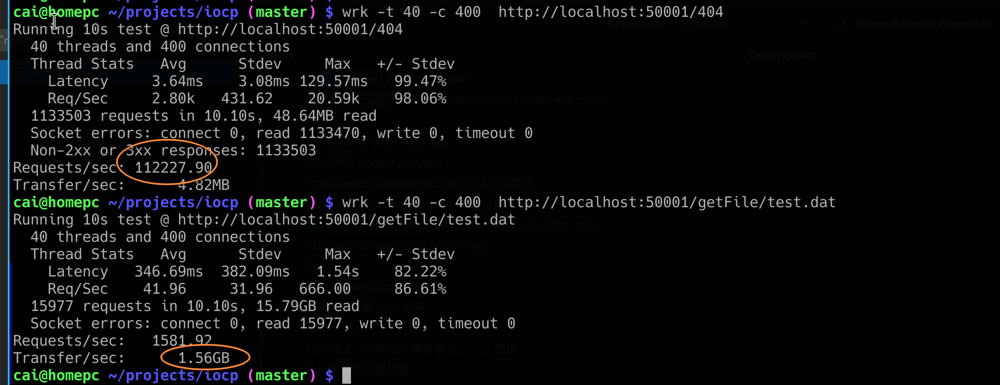

# iocp4linux 和 µasync

本仓库由两个项目构成，一曰 µasync， 二曰 iocp4linux

µasync 是一个构建在 IOCP 上的超轻量级协程库。
而为了能让 µasync 跨到Linux平台使用，同时有一个曰 iocp4linux 的库将 Linux 平台的接口封装为 IOCP。
从而使基于 µasync 编写的代码可以跨平台。

### 各个子文件夹的作用：

- example

    例子代码。

- iocp4linux

    linux版的 iocp 实现。 windows 上无需使用。

- iocp_asio

    使用 asio 作为后端实现的 IOCP 接口。windows 上无需使用。
    意味着 将 asio 支持的所有系统都能提供 iocp 了。
    除非找到 liburing.so 则会自动使用这个作为后端。

- µasync

    对 IOCP 进行协程封装的库。

- cmake

    本项目需要用到的一些 cmake 辅助脚本

- doc

    文档，图片

## 序

iocp4linux 如名字所言，它在 Linux 上实现IO完成端口。它的目的和 WEPOLL 正好相反。

iocp4linux as name suggest, provide windows equivalent IOCP API for linux. This is the reverse
of what wepoll does.

至于为何要和 wepoll 反着来，这可不是为了和 wepoll 赌气。
而是因为 reactor 实际上是一个残废模型。
具体可以参考 [proactor是最理想的模型](https://microcai.org/2024/11/19/proactor-is-better-than-reactor.html)

## Usage

对 cmake 管理的项目来说，使用 git submodule 或者 直接下载源码，将 本仓库置于 third_party/uasync 目录下。

然后使用

    add_subdirectory(third_party/uasync)
    link_libraries(uasync)

就可以使用了。

使用的时候，使用头文件 universal_async.hpp

##

## Compatibale

已经实现的接口有

| IOCP 接口                  | io_uring 后端 实现 状态 | asio 后端 （epoll） 实现状态 |
| -------------------------- | ----------------------- | ---------------------------- |
| CreateIoCompletionPort     | ✅                       | ✅                            |
| GetQueuedCompletionStatus  | ✅                       | ✅                            |
| PostQueuedCompletionStatus | ✅                       | ✅                            |
| WSASend                    | ✅                       | ✅                            |
| WSARecv                    | ✅                       | ✅                            |
| WSASendTo                  | ✅                       | 实现中                     |
| WSARecvFrom                | ✅                       | 实现中                     |
| AcceptEx                   | ✅                       | ✅                            |
| WSAConnectEx               | ✅                       | ✅                            |
| DisconnectEx               | ✅                       | ✅                            |
| CreateFileA                | ✅                       | ✅                            |
| CreateFileW                | ✅                       | ✅                            |
| ReadFile                   | ✅                       | API 可用，为同步模拟             |
| WriteFile                  | ✅                       | API 可用，为同步模拟             |
| CloseHandle                | ✅                       | ✅                            |
| CancelIo                   | ✅                       | 不支持                         |
| CancelIoEx                 | ✅                       | ✅                            |

# Performance

以下结果是运行 例子列程 ./test/web_server/server.cpp 所测得：

在请求一个 404 路径的时候，测试的是纯粹的网络服务能力。能达到每秒接受超过十一万连接。
查看源码可知这个 例程 并没有使用 HTTP 协议的 connection:keep-alive 能力。所以这就全靠内核硬扛下来的十一万个连接。

而第二个测试，是测试下载一个 1MiB 的文件。
而 server.cpp 内部特意使用了 1kb 的小 buffer 进行文件传输。
也就是每次只从文件系统读取1kb 字节，然后向 socket 发送 1kb 字节。

速度达到 1.5GB/s。也就是能完全跑满 10G 网卡。

如果使用更大的 buffer 进行数据搬运。那么跑满 100G 网络不在话下。

之所以测试的时候使用小buffer, 就是为了验证这个封装的网络库每秒能执行的 WSASend 极限。
事实证明性能完全足够使用小包跑满 10G 网络。而使用大包则可以跑满 100G 网络。

# 关于 µasync

如果你查看了 test 文件夹下的 示例，会发明他们包含了universal_async.hpp 头文件，然后使用协程的方式使用 IOCP, 这又是什么库呢？

在编写 iocp4linux 的过程中，我需要写一些测试代码。

一开始，我随便的找了一个基于 IOCP 的 echo test 和一个简单的 web server。
首先确保这弄来的例子能在 windows 上编译通过。

然后修改 ifdef _WIN32守卫，在 linux 平台上改为使用 iocp.h 头文件。

然后很轻松的就移植到 linux 上了。

但是，我对于这些 C 风格的 demo 并不满意。因为我完全改不动他们的代码。

于是，我想着，何不写一个超级轻量级的一个封装库？
这个库，应该做到跨平台 —— 指能同时兼容原版 windows.h和 iocp.h。然后代码尽量短小，同时又足够易用。

最后。我折腾出了一个超轻量级的协程库。

废话不说，先看一段 异步 accept 的代码：

在红框处，使用的是 windows 上的异步 accept 。
在 AcceptEx 调用的时候，传入了一个 ov 对象。
这个 ov 对象，类型是 awaitable_overlapped 。
awaitable_overlapped 可以隐式转换为 `WSAOVERLAPPED*` 从而被 AcceptEx 所接受。

由于是异步 IO ， 这时代码会继续向下运行。一般如果是在非协程的代码里。此时就应该返回函数。

然后把 accpet 的后续逻辑，放到 调用 `GetQueuedCompletionStatus` 的事件循环里了。

然后，进行协程化封装后，此时我们只需要等到投递的那个重叠对象，变成“完成”状态。

这就是 `co_await get_overlapped_result(ov)` 这行代码的任务了。

之后，client_socket 就是已经接受了的新连接了。

然后调用 CreateIoCompletionPort 将他和完成端口绑定。

最后创建一个新协程。echo_sever_client_session 来处理这个连接。

这也是这个协程库一个非常好用的地方，任何一个 ucoro::awaitable 协程，都可以要么 co_await 异步等待它，也可以调用 .detach()使它在“后台继续运行”。

由于这个 accpet 逻辑是不停的接受连接。因此，它要把处理逻辑委托给 一个独立的协程。
因此，这里不能使用 `co_await echo_sever_client_session(client_socket)` 而是应该使用
`echo_sever_client_session(client_socket).detach()` 将协程置入后台继续运行。

这一个异步 accept 的逻辑，代码异常**清晰**，**明了**。仿佛完全不是在使用 IOCP 这种极其复杂的 API。
就好像在使用传统的同步 accept 一样。而且使用的还是原生 windows API。 并不是使用本库封装的 accept。

这也是本库和其他网络库的一个巨大区别：尽量使用原生API。只是辅助用户管理 重叠IO事务。

那么是怎么实现让这个库管理重叠事务的呢？我们看下 main 函数：

原来 accept_coro().detach() 就创建了多个 accept 协程，并且并发的进行 accept.
然后 直接使用 run_event_loop(iocp_handle) 就把整个协程运转逻辑给跑起来了。

甚至不需要定义一个什么 io_service 对象！

另外，这个 awaitable_overlapped 可不是只能使用一次的东西。

看这个代码：

这个协程他只有一个 awaitable_overlapped 对象，但是 WSARecv 和 WSASend 都可以复用它。

对了，如果用在文件 IO 上，则需要不断调整文件的偏移量。这个是用 add_offset 实现的。如下图：

需要使用  set_offset 将读写指针移动到文件开头。
然后每次读取后，将返回的读取结果通过 add_offset 更新。

此时由于这个overlapped 要携带 offset 状态了，于是 WSASend 就不和共用一个 awaitable_overlapped 对象了。
毕竟 WSASend 可不支持传入 offset 偏移量。

这个库太好用了，其实就一个头文件。他就在 iocp4linux 的仓库里。名为 `universal_async.hpp`

只要包含这个头文件即可立即享受。

## 关于 awaitable.hpp

这个文件来自 [µcoro](https://github.com/avplayer/ucoro) 。 正是这个几百行的小代码，帮助 uasync 实现了 c++20 的协程支持。

